# About the project
There are many ways to research regarding on product market analysis, I try to do litle market analysis on t-shirt product just to know what is 
product are most sold, how the price, is there any intresting variable correlation in market place. With this analysis i believe it can be source of 
consideration in starting a clothing brand or launching t-shrit product.

But why t-shirt? here's why :
- Everyone is like at leats having t-shirt on daily basis right? it means t-shirt have broad market.
- T-shrit is cheap clothing item, everyone can buy it anyway.
- From business perspective t-shirt easy to produce

So i think this project is worth of time to do before starting your t-shirt business :wink:. 

# Goals and Objective
  * Goal
    - Provide price range and expected product sold of t-shirt.
  * Objective
    - Scrape data of t-shirt in tokopedia ecommerce.
    - Cleaning and analyze data.
    - Generate insight.

<details>
  <summary>Table of Contents</summary>
  <ol>
    <li>
      <a href="#about-the-project">About The Project</a>
    </li>
    <li>
      <a href="#goals-and-objective">Goals and Objective</a>
    </li>
    <li>
      <a href="#getting-started">Getting Started</a>
      <ul>
        <li><a href="#prerequisites">Prerequisites</a></li>
        <li><a href="#usage">Usage</a></li>
        <ul>
          <li><a href="#scraping">Scraping</a></li>
          <li><a href="#demonstration">Demonstration</a></li>
        </ul>
      </ul>
    </li>
    <li><a href="#roadmap">Roadmap</a></li>
    <li><a href="#analysis">Analysis</a></li>

  </ol>
</details>

# Getting Started
To run this project you will need Visual Studio Code to run web scraping script and Jupyter notebook to run data exploratory.
## Built with
- [![Python][Python.com]][Python-url]
- [![VScode][VScode.com]][VScode-url]
- [![Jupyter][Jupyter.com]][Jupyter-url]
- [![Selenium][Selenium.com]][Selenium-url]
<!-- - [![pandas][pandas.com]][pandas-url] -->
- <a href="https://pandas.pydata.org/">
    
  </a>
- [![BS][BS.com]][BS-url]

<!-- - [![matplotlib][matplotlib.com]][matplotlib-url] -->
- <a href="https://matplotlib.org/stable/index.html">
    
  </a>
<!-- - [![seaborn][seaborn.com]][seaborn-url] -->
- <a href="https://seaborn.pydata.org/index.html">
    
  </a>
## Prerequisites
These are some library you need to run the project, i put the pip installation to make it easy for you.

* Selenium
  ```sh
  pip install selenium
  ```
* BeautfulSoup
  ```sh
  pip install beautifulsoup4
  ```
* Pandas
  ```sh
  pip install pandas
  ```
* Matplotlib
  ```sh
  pip install matplotlib
  ```
* Seaborn
  ```sh
  pip install seaborn
  ```
* tqdm
  ```sh
  pip install tqdm
  ```
## Usage
This project divided in two steps, there are scraping and analyzing.
### Scraping
Scraping process is run in Visual Studio Code there are 2 python files:
- scrape_main.py
This file contains some function:
    - scr_last_page
    to get last page in search result 
    - scr_list_page
    create list of link for each page
    - scr_main
    get all product link
    - scr_sub
    get all product data properties
- scrape_launch.py
Here we looping to get all data using functions from scrape_main.py. Since the process take a lots of time we perform this process with pickle to save gathered data, and we can continue the process anytime. There are some pickle files here :
  - data_dict.pkl
    Data of gathered dictonary.
  - done_link.pkl
    List of gathered links.
  - fail_link.pkl
    List of failed links.
  - prod_link.pkl
    List of products url.

### Demonstration
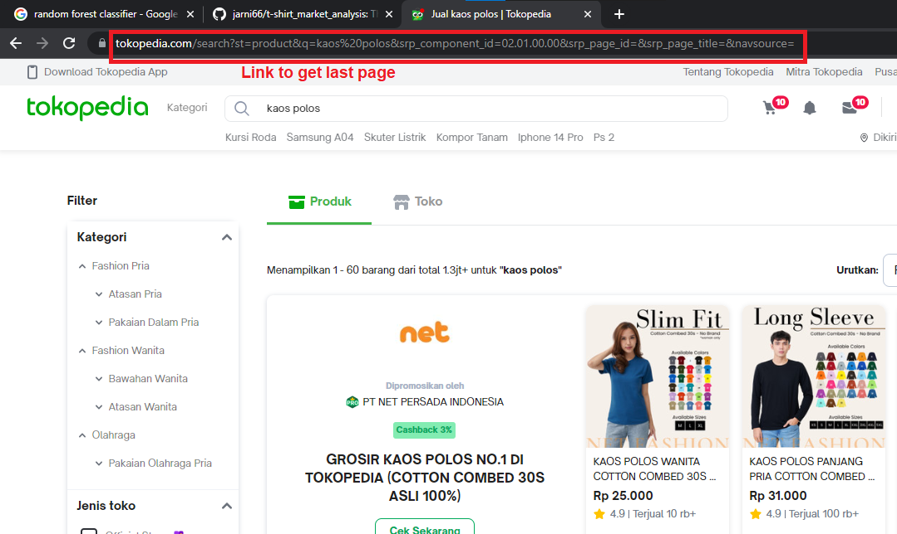
Picture above is search result page
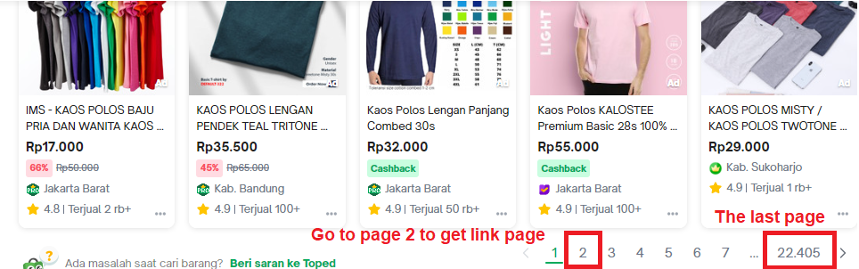
Picture above is bottom of the previous picture
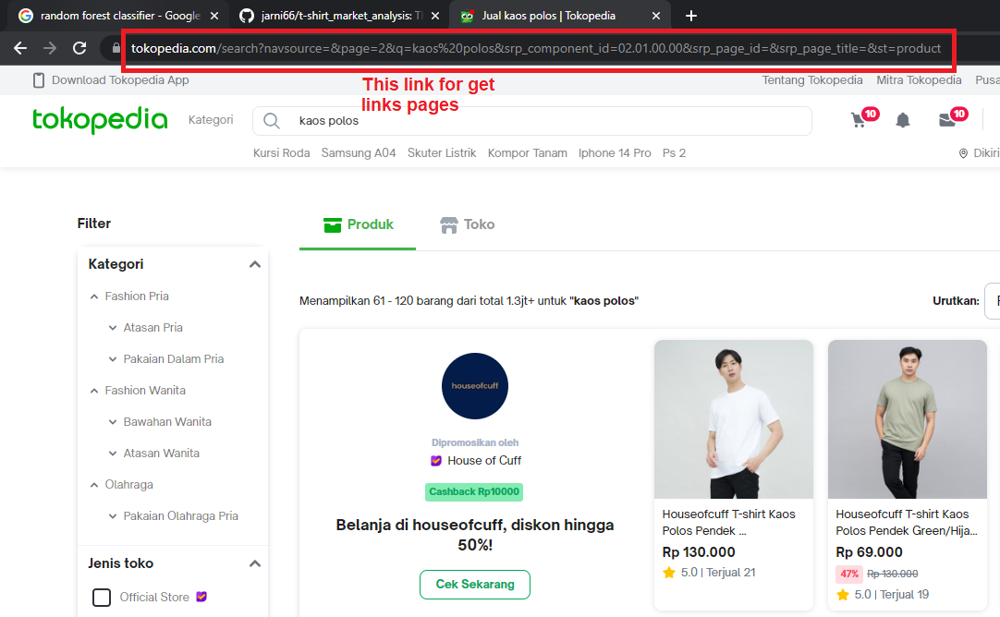
Picture above is on the page 2


# Analysis
Scraped data loaded in jupyter notebook in form of pkl and convert to dataframe. This is screen shot of raw data :

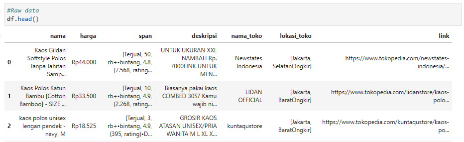

Data is processed into more clean form. This in shot of cleaned data. 

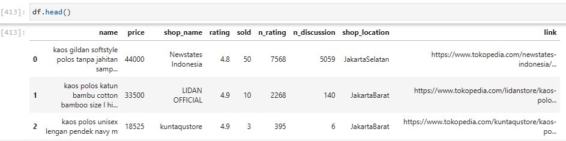

In categorical features there is no significant insight we can get. Majority t-shirt online shop were from Jabodetabek, Bandung and Surabaya. The most shop with t-shirt product are have 200 product and most of them aroung 50 product.

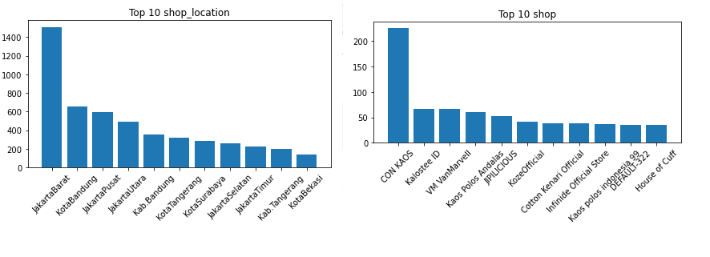


On numerical features there is some focused distrbution in number of sold, price and rating of the shop.

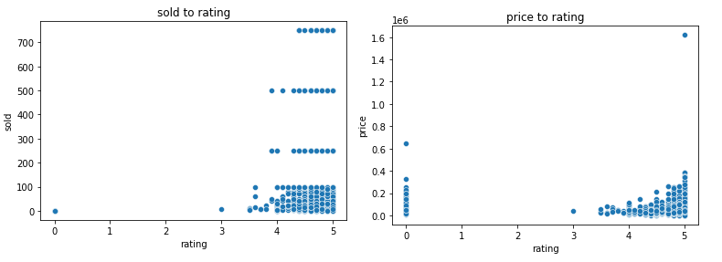

We try to scope down out observation in rating 3.5 above. And lets see for each rating in products sold.

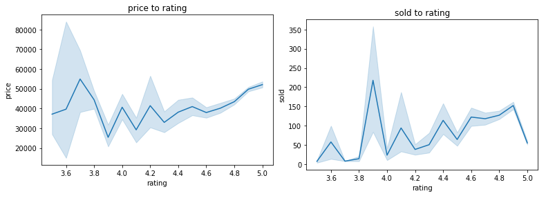

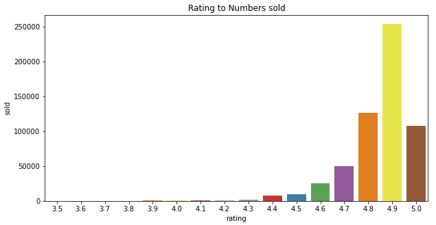

From this kind of chart we try to segment rating above 4.5 and under 4.5. There is some difference in this segment which higher rating can having possibilityto have higher price.

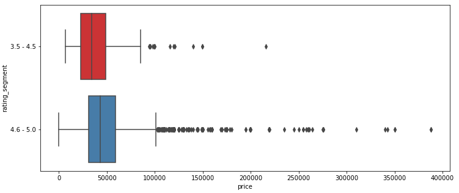

We combine the rating segment with number of sold and there is unique distribution for price and number of sold with significant rating segment.

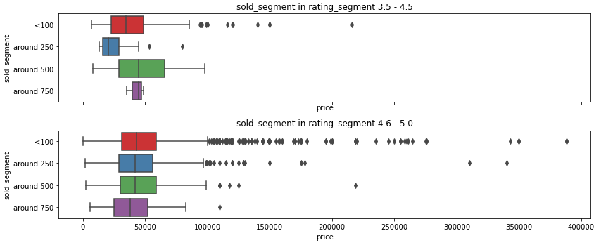

Although there are another factor that can affect number of sold, rating, and price we can gather some use full insight from chart above.
- T-shirt product are focused in rating <b>4.6 to 5.0 and 3.5  to 4.5.</b>
- Product with price more than 100,000 tend to have number of sold under 500
- T-shirt market value are in range<b> 30837.5 - 59000.0</b>


